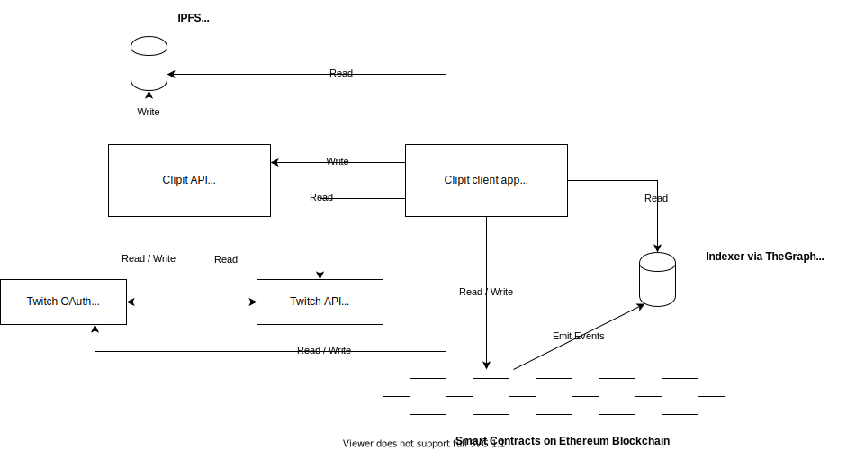

    
    </img>

<h1></h1>

[Clipit](https://clipit.fyi) is a platform for Twitch Streamers to earn additional revenue by rewarding their supporters with Clip NFTs.

Clipit started off as a project for me to play around and get some experience with Ethereum, Smart Contracts and Go, but with time we tried making it into a product and approached most of top 1000 English streamers to see if they'd be interested in something like this. TLDR: They were not.

<h1>Architecture</h1>

    
    </img>

<h2>Smart Contracts</h2>

There are three main contracts:

- `Clipit.sol` extension of ERC721 responsible for verifying sender signature (ownership of the Clip and Ethereum address) and minting the Clip NFTs
- `Market.sol` responsible for Bids/Asks on Clip NFTs
- `AuctionHouse.sol` responsible for running Auctions for Clip NFTs

Contracts were build on top of [Zora Protocol](https://docs.zora.co/docs/intro) with Hardhat.

Contracts [documentation](./hardhat/README.md).

<h2>Indexer</h2>

The Indexer is an off chain storage and indexing of Ethereum Smart Contract Events/Logs. The Indexer is deployed as a Subgraph on [TheGraph](https://thegraph.com/en/) protocol and accessible via GraphQL API.

<h2>Backend service</h2>

Clipit backend API is build in [Go](https://go.dev/) deployed via Google Cloud.
It consumes couple of third party APIs:

- Twitch OAuth - to authenticate users calling the Clipit API
- Twitch API to verify users ownership of the Clip and to download the Clip
- IPFS via Pinata - to upload the Clip & generated Metadata

The Clipit API also generates cryptographic ECDSA signature which is used by the `Clipit.sol` to verify users Clip ownership and ETH address.

Servers [documentation](./server/README.md).

<h2>Clients</h2>

There are 3 frontend client modes:

All of the clients were build with React and deployed via Firebase.

<h3>1. App</h3>
App is the main frontend client, where users are able to:

- Login with Twitch
- Display their Twitch Clips
- Mint Twitch Clip into NFT
- Display owned Clip NFTs and their statis
- Create Auctions for the Clip NFTs

Interaction with Ethereum is done via integration with Metamask Wallet. The App also reads contract data via GraphQL from the Indexer or directly from the Smart contracts, calls Twitch OAuth and APIs and reads Clips metadata via Pinata from IPFS.

    
    </img>

<h3>2. Demo Page</h3>
Demo Page is a basic "landing page" style client to collect interest about the platform. It could have been build as a static site, but it was not worth it to introduce another stack/app just for the existing purpose.

    
    </img>

<h3>3. Twitch Extension</h3>
Twitch Extension was build to allow one click generation of Clips into NFTs via Streamers "Stream Manager".

Clients [documentation](./app/README.md).

https://user-images.githubusercontent.com/38439473/181825459-676a50e3-a3e0-474d-85f4-ee34951491bb.mp4

 

<h1>Things to improve</h1>

There is a very long list of things that could be improved - from smarter build/deployment tooling on server, automation of ABI updates, through optimazing Contracts gas cost, better test coverage, metrics & tracing in server, broken/inconsistent desings/CSS, to better documentation and `TODO`s within the codebase there's certainly a lot of stuff that could be better.

<h1>Acknowledgements</h1>

A lot of open source work has been used in this project. Some notable mentions include [Zora Protocol](https://github.com/ourzora/core) and [Ardan Labs Starter code for web services](https://github.com/ardanlabs/service).

<h1>Disclaimer</h1>

No Twitch Clips created by Twitch streamers were turned into NFTs on Ethereum mainnet.
